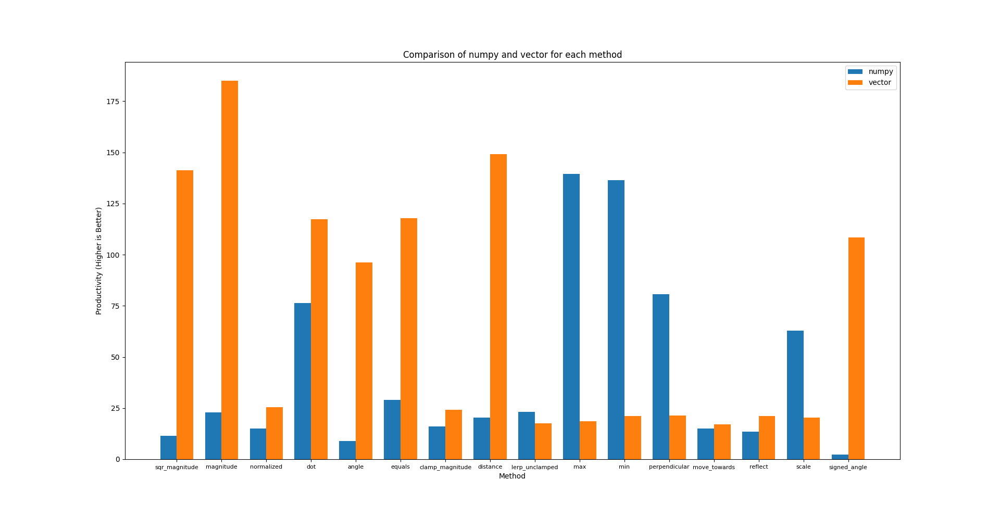

# rivector - risknu vectors
This Python library introduces a set of fast vector classes, designed for convenient and rapid vector operations, similar to those in Unity. It is well-suited for game development using Pygame and also useful for general mathematical applications. The library is open source and available on GitHub.

> ![NOTE]
> It's worth noting that while you can add your own methods to the module, the library may not be as stable as other vector libraries. Please exercise caution and consider testing thoroughly, especially when compared to more established alternatives.

## How it Works and Why It's Fast
The core mathematical logic and vector class are entirely written in C++. They are then utilized through CPython in Python, transforming it into a wrapper class that can be fully utilized in Python. Speaking of its power, here are some speed-related details, including a comparison with the popular numpy library in mathematics:



```diff
+ Vector2Wrapper 0.8779744120547548
- NumPy 1.6510654900339432
```

## Installation and Examples
To install this library on Python, you need Python version 3.12 or higher. Here are installation examples for different operating systems:

*Windows*
```bash
$ pip install rivector
```
*Linux/MacOS*
```bash
$ pip3 install rivector
```

*Usage Examples and Creating a Simple Vector:*
```python
from rivector import Vector2

vector = Vector2(10, 10)

print(vector.magnitude)  # Magnitude of the vector
print(vector + 10)  # Vector(20, 20)
print(vector + vector)  # Vector(20, 20)
# Other operations...
```

> ![NOTE]
> The library allows you to create and manipulate 2D vectors easily. You can find more details and methods in the [wiki](https://github.com/risknu/rivector/wiki) or in [official website](https://risknu.github.io/rivector). 

Feel free to contribute and enhance the functionality of the library as needed.

## License
This library is distributed under the Apache License 2.0.